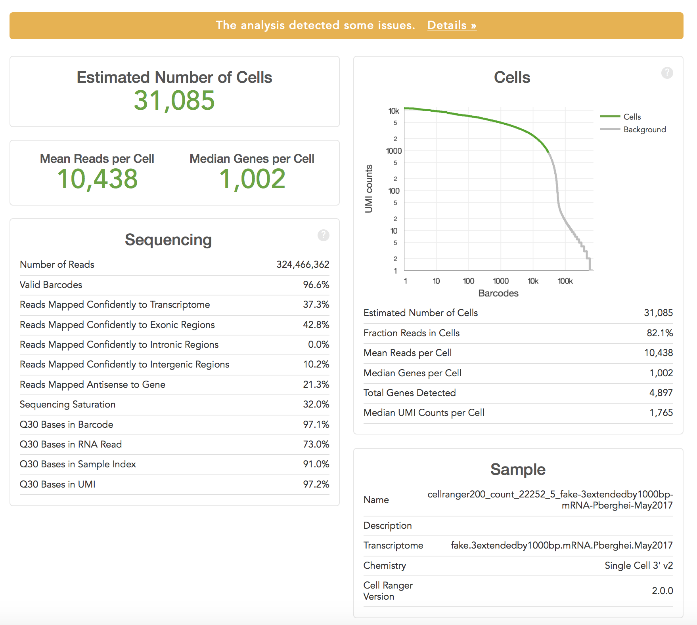
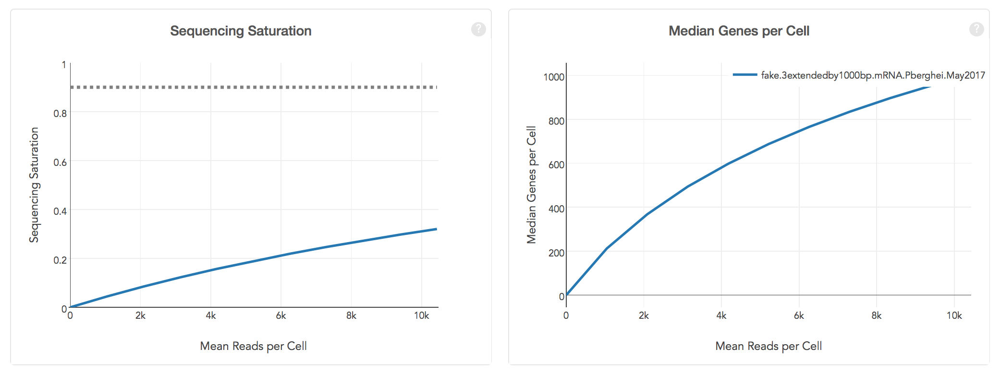

***
# 1. Introduction and Aims {.tabset}

This data has been processed using CellRanger into counts tables. This initial analysis gave the following metrics:

<b>Pb straight bleed experiment (run #: 22252 lane 5 Hiseq 4000)) (AKA 30K cells):</b>

<div style="width:500px; height:400px"></div>
<div style="width:500px; height:200px"></div>

# 2. Read in the data  {.tabset}

### Load the required packages

```{r load packages, echo = FALSE}
## Seurat is needed for most of this script
if(require("Seurat", quietly = TRUE)){
    print("Seurat is loaded correctly")
} else {
    print("trying to install Seurat")
    install.packages("Seurat")
    if(require(Seurat)){
        print("Seurat installed and loaded")
    } else {
        stop("could not install Seurat")
    }
}

## cowplot is needed for plots
if(require("cowplot")){
    print("cowplot is loaded correctly")
} else {
    print("trying to install cowplot")
    install.packages("cowplot")
    if(require(cowplot)){
        print("cowplot installed and loaded")
    } else {
        stop("could not install cowplot")
    }
}

## gridExtra is needed for grid graphics to plot multiple plots in the same view
if(require("gridExtra")){
    print("gridExtra is loaded correctly")
} else {
    print("trying to install gridExtra")
    install.packages("gridExtra")
    if(require(gridExtra)){
        print("gridExtra installed and loaded")
    } else {
        stop("could not install gridExtra")
    }
}

##for grid.arrange function to change size of title
if(require("grid")){
    print("grid is loaded correctly")
} else {
    print("trying to install grid")
    install.packages("grid")
    if(require(grid)){
        print("grid installed and loaded")
    } else {
        stop("could not install grid")
    }
}

## for doing bulk correlation calculations
if(require("Hmisc")){
    print("Hmisc is loaded correctly")
} else {
    print("trying to install Hmisc")
    install.packages("Hmisc")
    if(require(Hmisc)){
        print("Hmisc installed and loaded")
    } else {
        stop("could not install Hmisc")
    }
}

## dplyr is needed to work with data frames
if(require("dplyr")){
    print("dplyr is loaded correctly")
} else {
    print("trying to install dplyr")
    install.packages("dplyr")
    if(require(dplyr)){
        print("dplyr installed and loaded")
    } else {
        stop("could not install dplyr")
    }
}

## set the seed for both the mixture models and also for the sample function later on:
set.seed(-92497)
```

### Import GTF file

This will be helpful later on. This contains annotations for each gene:
```{r import GTF}
##Import gtf file:
gtf <- read.table("../data/Reference/Pberghei.gtf", sep="\t", header = FALSE)
head(gtf)
```

# 30K data {.tabset}

## Read in the Data

```{r}
tenx30k_raw_data <- Read10X("tenx_22252_5")

#'control' object
tenx30k <- CreateSeuratObject(counts = tenx30k_raw_data, min.cells = 0, min.features = 0, project = "GCSKO")
tenx30k@meta.data$experiment <- "tenx30k"
```

## A. Defining Cells vs. Background

knee plot
```{r}
## interesting reference material can be found here: https://hemberg-lab.github.io/scRNA.seq.course/processing-raw-scrna-seq-data.html 
## get the nUMIs
umi_per_barcode <- as.data.frame(tenx30k@meta.data$nCount_RNA)
## remove zeros as these have issues when you log them and make the model later:
umi_per_barcode <- as.data.frame(umi_per_barcode[!(umi_per_barcode$`tenx30k@meta.data$nCount_RNA`==0), ])
# get a rank for each barcode
barcode_rank <- rank(-umi_per_barcode[,1])
# then make into a list
lib_size <- (umi_per_barcode[,1])
#then log this
log_lib_size <- log10(umi_per_barcode[,1])
#plot(barcode_rank, log_lib_size, xlim=c(1,100000))
```

```{r}
o <- order(barcode_rank)
log_lib_size <- log_lib_size[o]
barcode_rank <- barcode_rank[o]

#rawdiff <- diff(log_lib_size)/diff(barcode_rank)
#inflection <- which(rawdiff == min(rawdiff[100:length(rawdiff)], na.rm=TRUE))

#plot(barcode_rank, log_lib_size, xlim=c(1,8000))
#abline(v=inflection, col="red", lwd=4)
```

make a mixture model to determine the knee of the plot
```{r}
set.seed(-92497)
# mixture model
require("mixtools")
mix <- normalmixEM(log_lib_size)
plot(mix, which=2, xlab2="log(mol per cell)")
```

```{r}
p1 <- dnorm(log_lib_size, mean=mix$mu[1], sd=mix$sigma[1])
p2 <- dnorm(log_lib_size, mean=mix$mu[2], sd=mix$sigma[2])
if (mix$mu[1] < mix$mu[2]) {
    split <- min(log_lib_size[p2 > p1])
} else {
    split <- min(log_lib_size[p1 > p2])
}
split
```

```{r}
log_barcode_rank <- log10(barcode_rank)
plot(log_barcode_rank, log_lib_size, xlim=c(1,6))
abline(h=split, col="red")
```

Final Figures:
```{r}
require(scales) # to access break formatting functions
df_barcodes <- as.data.frame(cbind(barcode_rank, log_lib_size), row.names = NULL)
#add a column for if it is a cell
df_barcodes$cell = rownames(df_barcodes) %in% which(df_barcodes$log_lib_size > split)
#change value to a numeric
df_barcodes$cell <- as.numeric(df_barcodes$cell)
df_barcodes$cell[df_barcodes$cell<1] <- 2
df_barcodes$cell[df_barcodes$cell == 1] <- "Cells"
df_barcodes$cell[df_barcodes$cell == 2] <- "Background"
ncells <- as.numeric(data.frame(table(df_barcodes$cell))[2,2])

library(scales) # to access break formatting functions
barcode_plot_30k <- ggplot(df_barcodes, aes(x=barcode_rank, y=log_lib_size, colour = cell, theme_size = 40)) +
  geom_point(size = 1, shape = 15) +
  geom_segment(aes(x = 0, y = split, xend = ncells, yend = split), colour = "black", alpha = 0.01) +
  geom_segment(aes(x = ncells, y = 0, xend = ncells, yend = split), colour = "black", alpha = 0.01) +
  scale_x_log10(breaks = trans_breaks("log10", function(x) 10^x), labels = trans_format("log10", math_format(10^.x))) +
  scale_y_continuous(labels = c('0',bquote(10^1), bquote(10^2), bquote(10^3), bquote(10^4))) + annotation_logticks() +
  scale_color_manual(values=c("#bdbdbd", "#5ba43a"), labels = c("Background", "Cells")) +
  theme(legend.position="right", text = element_text(size=20), legend.text=element_text(size=20), axis.text=element_text(size=20)) +
  labs(x = "Barcodes", y = "UMI Counts", colour="Cell Designation") +
  guides(colour = guide_legend(override.aes = list(size=10))) +
  coord_fixed() +
  theme_light()

barcode_plot_30k
```

save:
```{r}
ggsave("barcode_plot_30k.png", plot = barcode_plot_30k, device = "png", height = 10, width = 10, units = "cm", path = "~/images_to_export")
```

so the number of cells that is retained is:
```{r, echo = FALSE}
table(df_barcodes$cell)
```

Filter the object:
```{r}
upb <- data.frame(nCount_RNA = tenx30k@meta.data$nCount_RNA, row.names = rownames(tenx30k@meta.data))
upb$rank <- NA
order.scores <- order(upb$nCount_RNA, decreasing = TRUE)
upb$rank[order.scores] <- 1:nrow(upb)
head(upb)
keep_cells <- rownames(upb[which(upb$rank < ncells),])
pb_sex_30k <- SubsetData(tenx30k, cells = keep_cells, do.clean = TRUE, subset.raw = TRUE)
```

## B. Filter Out Poor-Quality Cells

plot the cells:
```{r}
#inspect the ngenes and nUMI
gene_plot_30k <- VlnPlot(object = pb_sex_30k, features = "nFeature_RNA", pt.size = 0.01, do.return = TRUE)

gene_plot_30k <- gene_plot_30k + 
  geom_abline(intercept = 200, col="blue") +
  labs(x = "",y = "nGene", title = "Genes per cell") +
  theme_classic() +
  scale_fill_manual(values="grey") +
  scale_y_continuous(limits = c(0, 3000)) +
  theme(legend.position="none", axis.text.x = element_blank(), axis.ticks.x=element_blank(), text = element_text(size=20), legend.text=element_text(size=20), axis.text=element_text(size=20), axis.text.y=element_text(colour="black"))

#nUMI plot
numi_plot_30k <- VlnPlot(object = pb_sex_30k, features = "nCount_RNA", pt.size = 0.01, do.return = TRUE)

numi_plot_30k <- numi_plot_30k +
  labs(x = "",y = "nUMI", title = "UMIs per cell") +
  theme_classic() +
  scale_fill_manual(values="grey") +
  scale_y_continuous(limits = c(0, 3000)) +
  theme(legend.position="none", axis.text.x = element_blank(), axis.ticks.x=element_blank(), text = element_text(size=20), legend.text=element_text(size=20), axis.text=element_text(size=20), axis.text.y=element_text(colour="black"))

#plot together
grid.arrange(gene_plot_30k, numi_plot_30k, ncol = 2, top=textGrob("30K cells 10X", gp=gpar(fontsize=15,font=8)))
```

The threshold used in the malaria cell atlas was 230 for Pb but this is dependent on sequencing depth etc.
We can plot the number of cells recovered for a range of thresholds:
```{r}
nrow(pb_sex_30k@meta.data[pb_sex_30k@meta.data$nFeature_RNA > 150, ])
nrow(pb_sex_30k@meta.data[pb_sex_30k@meta.data$nFeature_RNA > 200, ])
nrow(pb_sex_30k@meta.data[pb_sex_30k@meta.data$nFeature_RNA > 230, ])
```

Since we have already filtered on nUMI, we will filter with 200.

```{r}
## number of cells before filtering
pb_sex_pre_filter_nCells <- nrow(pb_sex_30k@meta.data)
## filter object
pb_sex_30k <- subset(pb_sex_30k, subset = nFeature_RNA > 200)
## number of cells after filtering
pb_sex_post_filter_nCells <- nrow(pb_sex_30k@meta.data)
## print results of filtering
pb_sex_pre_filter_nCells
pb_sex_post_filter_nCells
```

save ngene plot
```{r}
ggsave("ngene_plot.pdf", plot = gene1, device = "pdf", height = 5, width = 5, units = "in", path = "/Users/ar19/Desktop/PhD/GCSKO_Analysis")
```

```{r, echo = FALSE}
pb_sex_pre_filter_nCells - pb_sex_post_filter_nCells
```
cells were removed by filtering on number of genes.

## C. Dimensionality Reduction and Clustering 

normalise
```{r}
## normalise object
pb_sex_30k <- NormalizeData(pb_sex_30k, normalization.method = "LogNormalize", scale.factor = 10000)
```

find variable genes
```{r}
pb_sex_30k <- FindVariableFeatures(pb_sex_30k, selection.method = "vst", nfeatures = 2000)
```

scale the data
```{r}
all.genes <- rownames(pb_sex_30k)
pb_sex_30k <- ScaleData(pb_sex_30k, features = all.genes)
```

```{r}
pb_sex_30k <- RunPCA(pb_sex_30k, features = VariableFeatures(object = pb_sex_30k))
```

```{r}
DimPlot(pb_sex_30k, reduction = "pca")
```

```{r}
ElbowPlot(pb_sex_30k, ndims = 30, reduction = "pca")
```

```{r}
pb_sex_30k <- FindNeighbors(pb_sex_30k, dims = 1:21)
pb_sex_30k <- FindClusters(pb_sex_30k, resolution = 1)
```

```{r}
pb_sex_30k <- RunUMAP(pb_sex_30k, dims = 1:5, seed.use = 2000, n.neighbors = 200)
DimPlot(pb_sex_30k, reduction = "umap", group.by = "ident", label = TRUE)
```

colour with a few marker genes:

```{r, fig.height = 6, fig.width = 8}
# PBANKA-0515000 - p25 - female
# PBANKA-1212600 - HAP2 - male
# PBANKA-0600600 - NEK3 - male
# PBANKA-0831000 - MSP1 - late asexual
# PBANKA-1315700 - RON2 - (asexuals and some male?)
# PBANKA-0416100 - dynenin heavy chain - male - used in 820 line
# PBANKA-1319500 - CCP2 - female - used in 820 line 
# PBANKA-1437500 - AP2-G - seuxal commitment gene
# PBANKA-1102200 - MSP8 - early asexual (from Bozdech paper)

FeaturePlot(pb_sex_30k, features = c("PBANKA-0515000", "PBANKA-1212600","PBANKA-0600600", "PBANKA-0831000", "PBANKA-1315700", "PBANKA-0416100", "PBANKA-1319500", "PBANKA-1437500", "PBANKA-1102200"))
```

## D. Remove Doublets

```{r}
#devtools::install_github('chris-mcginnis-ucsf/DoubletFinder')
#library(doubletFinder) #allows removal of doublets
# the tutorial recommends using this as an approximation:
#nExp_poi <- round(0.15*nrow(pb_sex_30k@meta.data))
#but a more appropriate approximation is that the expected number of doublets is ~1% per 1000 cells so:
nExp_poi <- round((0.01*(nrow(pb_sex_30k@meta.data)/1000))*nrow(pb_sex_30k@meta.data))
#run doublet finder:
pb_sex_30k <- doubletFinder_v3(pb_sex_30k, PCs = 1:21, pN = 0.25, pK = 0.01, nExp = nExp_poi, reuse.pANN = FALSE, sct = FALSE)
```

results in:
```{r}
table(pb_sex_30k@meta.data$DF.classifications_0.25_0.01_19402)
```

visualise where doublets are:
```{r}
doublet.cells <- c(rownames(pb_sex_30k@meta.data[pb_sex_30k@meta.data$DF.classifications_0.25_0.01_19402 == "Doublet",]))
d2 <- DimPlot(pb_sex_30k, reduction = "umap", cells.highlight = doublet.cells, sizes.highlight = 2)
doublet2 <- d2 + coord_fixed() + theme(axis.text.x=element_blank())
doublet2
```

```{r}
VlnPlot(object = pb_sex_30k, features = "pANN_0.25_0.01_19402", pt.size = 0.01)
```


```{r}
df <- pb_sex_30k@meta.data
df <- df[,c(6,8)]
df <- data.frame(rbind(table(df)))
df$pc_doublet <- ((df[,1])/((df[,1]) + df[,2]))*100
df$cluster <- rownames(df)
#plot
kable(df[order(df$pc_doublet),])
```

```{r}
ggplot(data=df, aes(x=cluster, y=pc_doublet)) +
  geom_col(fill="steelblue") +
  theme_minimal()
```

The clusters with the least doublets:
0 - asex 1
1 - asex 2
10 - female

remove doublets:
```{r}
keep_singlets <- rownames(pb_sex_30k@meta.data[pb_sex_30k@meta.data$DF.classifications_0.25_0.01_19402 == "Singlet",])
pb_30k_sex_filtered <- subset(pb_sex_30k, cells = keep_singlets, subset.raw = TRUE)
pb_sex_30k
pb_30k_sex_filtered
```

## E. Life Cycle Stage (Using Bulk RNA-Seq Correlation)

Add in bulk data predictions

### hoo et al.
```{r hoo 30k}
#Pb Prediction correlations with bulk data (asexual hoo): 

#Load in required package:
library(Hmisc)
#Cooerce expression data into a matrix and load in the reference timecourse data:
x10 <- as.matrix(pb_30k_sex_filtered@assays$RNA@data)
rownames(x10) <- gsub("-", "_", rownames(x10))
#read in bulk data:
hoo<-as.matrix(read.table("Reference_bulk_data/hoo_berg2.txt",header=T, row.names=1))
#Make a blank dataframe in which to add prediction:
df <- data.frame(matrix(ncol = 4, nrow = 0))
colnames(df) <- c("Prediction(Spearman)","r(Spearman)","Prediction(Pearsons)","r(Pearsons)")
#Do correlations with bulk data using both Spearman and Pearson (and the top 1000 genes):
for (i in 1:ncol(x10))
{
  shared<-intersect(row.names(as.matrix(head(sort(x10[,i], decreasing=TRUE),1000))),row.names(hoo))
  step0<-rcorr(x10[shared,i],hoo[shared,1:12],type = "spearman")
  step1<-as.matrix(t(step0$r[2:13,1]))
  step2<-rcorr(x10[shared,i],hoo[shared,1:12],type = "pearson")
  step3<-as.matrix(t(step2$r[2:13,1]))
  step4<-cbind(colnames(step1)[which.max(step1)],step1[which.max(step1)],colnames(step3)[which.max(step3)],step3[which.max(step3)])
  colnames(step4) <- c("Prediction(Spearman)","r(Spearman)","Prediction(Pearsons)","r(Pearsons)")
  rownames(step4)<-colnames(x10)[i]
  df<-rbind(df,step4)
}
#Write out data into a csv file:
#write.csv(dfringr,file="/Users/ar19/Desktop/PhD/AR04_GCSKO_project/All_mutants_Feb_2018/predictionpbcombined.csv")
#Change the format of the output to make it more readable:
#gsub("Pb_","", dfringr[,1]) - Make predictions into 18hr.dat format:

#spearman:
df[,1] <- gsub("Pb_","", df[,1])
#Remove hr.dat from list:
df[,1] <- gsub("hr.dat","", df[,1])
#Check - dfringr[,1]
#Make into a number:
df[,1] <- as.numeric(df[,1])
df[,2] <- as.numeric(as.character(df[,2]))

#pearson:
df[,3] <- gsub("Pb_","", df[,3])
#Remove hr.dat from list:
df[,3] <- gsub("hr.dat","", df[,3])
#Check - dfringr[,1]
#Make into a number:
df[,3] <- as.numeric(df[,3])
df[,4] <- as.numeric(as.character(df[,4]))
#add to 10X object:
pb_30k_sex_filtered <- AddMetaData(pb_30k_sex_filtered, metadata = df)
```

### Kasia's data
Can also do with Kasia's timecourse data:
```{r kasia_30k}
kas<-as.matrix(read.table("Reference_bulk_data/AP2OETC.txt",header=T, row.names=1))
#Make a blank dataframe in which to add prediction:
dfs <- data.frame(matrix(ncol = 4, nrow = 0))
colnames(dfs) <- c("ID","Prediction","r (Pearson)")
#Do correlations with bulk data using both Spearman and Pearson (and the top 1000 genes):
for (i in 1:ncol(x10))
{
  shared<-intersect(row.names(as.matrix(head(sort(x10[,i], decreasing=TRUE),1000))),rownames(kas))
  step0<-rcorr(x10[shared,i],kas[shared,1:10],type = "spearman")
  step1<-as.matrix(t(step0$r[2:11,1]))
  step2<-rcorr(x10[shared,i],kas[shared,1:10],type = "pearson")
  step3<-as.matrix(t(step2$r[2:11,1]))
  step4<-cbind(colnames(step1)[which.max(step1)],step1[which.max(step1)],colnames(step3)[which.max(step3)],step3[which.max(step3)])
  colnames(step4) <- c("Prediction(Spearman)","r(Spearman)","Prediction(Pearsons)","r(Pearsons)")
  rownames(step4)<-colnames(x10)[i]
  dfs<-rbind(dfs,step4)
}
#Write out data into a csv file:
#write.csv(df,file="/Users/ar19/Desktop/PhD/AR04_GCSKO_project/All_mutants_Feb_2018/predictionkasiacombined.csv")

#Change the format of the output to make it more readable:
#gsub("Pb_","", dfs[,1]) - Make predictions into 18hr.dat format:
dfs[,1] <- gsub("X","", dfs[,1])
#Make into a number:
dfs[,1] <- as.numeric(dfs[,1])
#Make into a number:
dfs[,2] <- as.numeric(as.character(dfs[,2]))

#gsub("Pb_","", dfs[,1]) - Make predictions into 18hr.dat format:
dfs[,3] <- gsub("X","", dfs[,3])
#Make into a number:
dfs[,3] <- as.numeric(dfs[,3])
#dfs[,1]
#Make into a number:
dfs[,4] <- as.numeric(as.character(dfs[,4]))

colnames(dfs) <- c('Prediction(Spearman)_Kasia', 'r(Spearman)_Kasia', 'Prediction(Pearson)_Kasia', 'r(Pearson)_Kasia')
#add to Seurat:
#add to 10X object:
pb_30k_sex_filtered <- AddMetaData(pb_30k_sex_filtered, dfs)
```

## confirm identities

```{r}
pb_30k_sex_filtered <- RunUMAP(pb_30k_sex_filtered, dims = 1:21, seed.use = 800, n.neighbors = 200)
DimPlot(pb_30k_sex_filtered, reduction = "umap", group.by = "ident", label = TRUE)
```

Confirm life cycle designations:

```{r}
pb_30k_sex_filtered@meta.data
FeaturePlot(pb_30k_sex_filtered, features = c("Prediction(Spearman)_Kasia", "Prediction(Spearman)"))
```

```{r}
FeaturePlot(pb_30k_sex_filtered, features = c("PBANKA-0515000", "PBANKA-1212600","PBANKA-0600600", "PBANKA-0831000", "PBANKA-1315700", "PBANKA-0416100", "PBANKA-1319500", "PBANKA-1437500", "PBANKA-1102200"))
```

N.B. These UMAPs are computed with the statistics of the doublet containing object so we will recalculate these in the next script

```{r}
pb_30k_sex_filtered <- RunPCA(pb_30k_sex_filtered, features = VariableFeatures(object = pb_30k_sex_filtered))
```

```{r}
pb_30k_sex_filtered <- RunUMAP(pb_30k_sex_filtered, reduction = "pca", dims = 1:8, n.neighbors = 50, seed.use = 1234, min.dist = 0.5, repulsion.strength = 0.05)
DimPlot(pb_30k_sex_filtered, reduction = "umap", group.by = "ident", label = TRUE)
```

```{r}
table(pb_30k_sex_filtered@meta.data$seurat_clusters)
```

subsample
```{r}
pb_30k_sex_filtered_subsample <- SubsetData(pb_30k_sex_filtered, max.cells.per.ident = 2000)
```

```{r}
pb_30k_sex_filtered_subsample <- FindVariableFeatures(pb_30k_sex_filtered_subsample, selection.method = "vst", nfeatures = 1000)
pb_30k_sex_filtered_subsample <- RunPCA(pb_30k_sex_filtered_subsample, features = VariableFeatures(object = pb_30k_sex_filtered_subsample))
```

```{r}
pb_30k_sex_filtered_subsample <- RunUMAP(pb_30k_sex_filtered_subsample, reduction = "pca", dims = 1:9, n.neighbors = 50, seed.use = 1234, min.dist = 0.5, repulsion.strength = 0.05)
DimPlot(pb_30k_sex_filtered_subsample, reduction = "umap", group.by = "ident", label = TRUE)
```

```{r, fig.width = 10, fig.length = 10}
FeaturePlot(pb_30k_sex_filtered_subsample, features = c("PBANKA-0515000", "PBANKA-1212600","PBANKA-0600600", "PBANKA-0831000", "PBANKA-1315700", "PBANKA-0416100", "PBANKA-1319500", "PBANKA-1437500", "PBANKA-1102200"))
```
